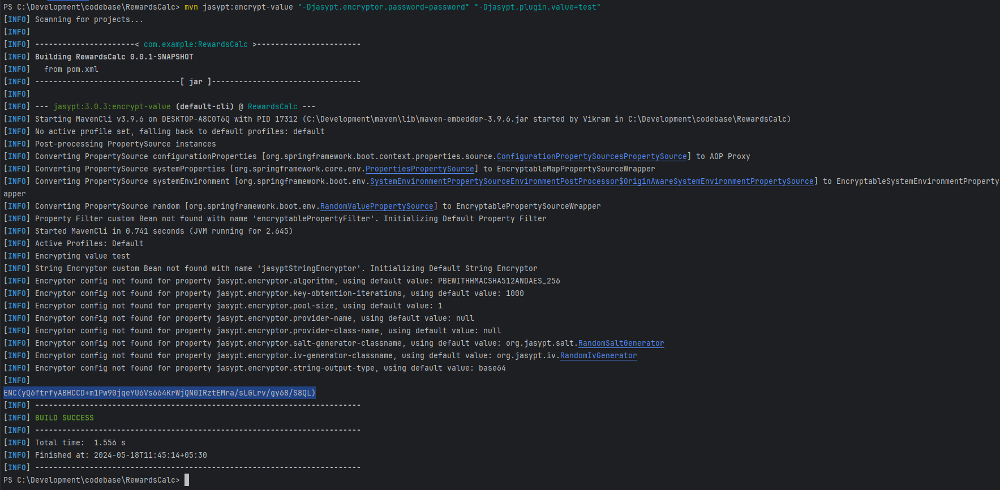

# RewardsCalc

Running spring boot as a deamon (in linux server)

     nohup java -jar RewardsCalc-0.0.1-SNAPSHOT.jar 

Implemented SSL: https://www.baeldung.com/spring-boot-https-self-signed-certificate

` keytool -genkeypair -alias baeldung -keyalg RSA -keysize 2048 -storetype PKCS12 -keystore baeldung.p12 -validity 3650`

to access the https service import the public key, placed in the keystore for reference.
baeldung_public_certificate.cer

### Encrypt DB password using jasypt library

mvn config:-

        <dependency>
            <groupId>com.github.ulisesbocchio</groupId>
            <artifactId>jasypt-spring-boot-starter</artifactId>
            <version>3.0.4</version>
        </dependency>

        <plugin>
            <groupId>com.github.ulisesbocchio</groupId>
            <artifactId>jasypt-maven-plugin</artifactId>
            <version>3.0.3</version>
        </plugin>

 ` mvn jasypt:encrypt-value "-Djasypt.encryptor.password=password" "-Djasypt.plugin.value=test"`

set vm values & pass at runtime

` java -jar .\target\RewardsCalc-0.0.1-SNAPSHOT.jar --jasypt.encryptor.password=passkey --jasypt.encryptor.algorithm=PBEWithMD5AndDES `

